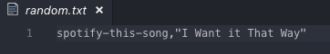

# LIRI_Bot

This is a a command line node application that takes in specific parameters and pulls information for specific APIs. Below lists the specific parameters referenced above and the APIs they call from. 

* Concert-this / Bands in Town Artist Events API 
* Spotify-this-Song / Node-Spotify-API
* Movie-this / OMDB API
* Do-What-It-Says / OMDB API, Node-Spotify-API or Bands in Town Artist Events API.

To use this application, the user will open the terminal from the file in which the application is stored. In the terminal, the user will then type node liri.js followed by either Concert-this, Spotify-this-Song, Movie-this or Do-What-It-Says. Depending on what follows liri.js additional text may be needed.

**Concert-This**
Concert-this takes the input of an artist/groups name and displays the venue name, venue location and time of the artist/groups next concert. 

To run this search, users will type the following: node liri.js concert-this <Artist/Group Name> 

The below screenshot provides an example for a search of Elton John.

Once you have entered the necessary text, you run the search by pressing the enter key and the output will be display in the terminal. The below screenshot are the results from the Elton John search.

**Spotify-this-Song**
Spotify-this-Song takes the input of a song name and displays the following: 
* artist(s)
* the song's name
* a link to the song on Spotify 
* the name of an album that the song is on

To run this search, users will type the following: node liri.js concert-this <Song Name>
* Note, if a song name is not entered the application defaults to search for "The Sign" by Ace of Base  

The below screenshot provides an example for a search of Tubthumping.

Once you have entered the necessary text, you run the search by pressing the enter key and the output will be display in the terminal. The below screenshot are the results from the Elton John search.

**Movie-this**
Movie-this takes the input of a movie title and displays the following:
* Title of the Movie
* Year the movie came out
* IMDB Rating of the movie
* Rotten Tomatoes Rating of the movie
* Country where the movie was produced
* Language of the movie
* Plot of the movie
* Actors in the movie

To run this search, users will type the following: node liri.js movie-this <Movie Title>
* Note, if a movie title is not entered the application defaults to search for "Mr. Nobody"  

The below screenshot provides an example for a search of The Princess Bride.

Once you have entered the necessary text, you run the search by pressing the enter key and the output will be display in the terminal. The below screenshot are the results from the Elton John search.

**Do-What-It-Says**
Do-What-It-Says takes the input found in the random.txt file. This could be:
* concert-this followed by a artist/groups name
* spotify-this-song followed by a song name
* movie-this followed by a movie title

To run this search, users will type the following: node liri.js do-what-it-says

Nothing is required following do-what-it-says as the input is pulled from random.txt. The below screenshot show an example of the random.txt file.

Below is a screenshot of running this in the terminal.

Below is a screenshot of the results.

 

As you can see, the results are a spotify-this-song for I Want It That Way, which is what was in the example random.txt file.

This project is a great introduction into NodeJS and uses vanilla javascript along with the request and moment npms and various APIs.   

This project is currently maintained and updated by Andrew Andersen (andersac88@gmail.com) if you have any questions, feel free to contact me directly.

Link to my Portfolio:
https://andersac88.github.io/